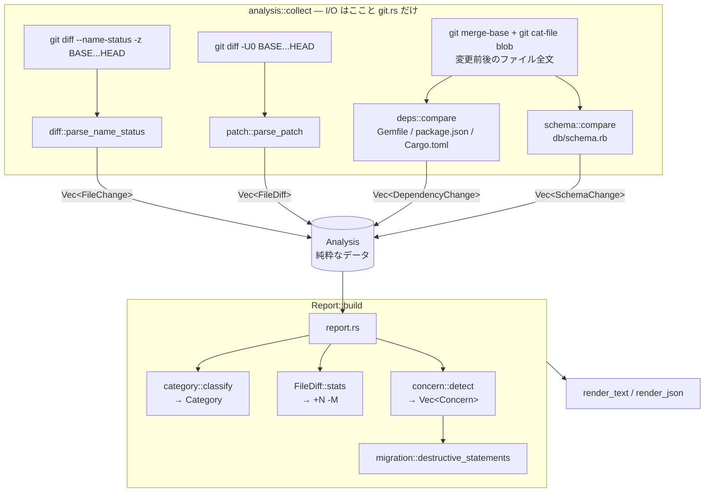

# rview 設計ドキュメント

## ゴール

`rview <BASE>` で `BASE...HEAD` の変更ファイルを取得し、レビュー観点のカテゴリ
(DB / API / Logic / Test / Config / Other) に分類して表示する。
加えて、ファイルパスだけから判断できる「Possible concerns」を提示する。

## パイプライン

`Analysis` を境に「I/O」と「判定・表示」を分けている。
`concern` や `report` は `Analysis::from_changes` で組み立てたデータだけでテストできる。

## モジュール

| モジュール | 責務 | 主な型 |
| --- | --- | --- |
| `git` | `git` コマンドの実行とエラー整形 | `GitError` |
| `diff` | `--name-status -z` 出力のパース | `ChangeKind`, `FileChange` |
| `patch` | `-U0` の unified diff のパース | `FileDiff`, `Hunk`, `Stats` |
| `deps` | 依存マニフェストのパースと比較 | `Deps`, `DependencyChange` |
| `schema` | `db/schema.rb` のパースと比較 | `Schema`, `SchemaChange` |
| `migration` | 破壊的なマイグレーション文の検出 | `destructive_statements()` |
| `analysis` | git から上記の材料を集める (I/O) | `Analysis`, `AnalyzeError` |
| `category` | パスからカテゴリへの分類 | `Category`, `classify()` |
| `concern` | レビューで注意すべきシグナルの検出 | `Concern`, `detect()` |
| `report` | 集約・ソート・出力 | `Report`, `Group`, `FileEntry` |
| `main` | CLI 引数 (clap) | `Cli`, `Format` |

## 設計判断

### `-z` オプションでパースする

`git diff --name-status` の通常出力は、特殊文字を含むパスをクォート・エスケープする。
`-z` を使うとフィールドが NUL 区切りになり、パスが加工されないため、
タブや空白、非 ASCII 文字を含むパスでも確実にパースできる。

### 三点リーダ (`BASE...HEAD`)

Pull Request と同じく「`HEAD` と `BASE` のマージベース」からの差分を見る。
`BASE` 側だけで進んだ変更はレビュー対象に含めない。

### リネーム検出 (`-M`)

リネームを `D` + `A` ではなく `R` として扱い、旧パスも保持する
(`FileChange::old_path`)。分類は新パスで行う。

### 分類ルールの優先順位

最初にマッチしたルールを採用する。より具体的なルールを先に評価する。

1. **Test** — `spec/`, `test/`, `tests/`, `__tests__/` ディレクトリ、`*_spec.rb`, `*.test.ts` などの命名
2. **DB** — `db/migrate/`, `db/schema.rb`, `migrations/`, `*.sql` など
3. **API** — `app/controllers/`, `config/routes.rb`, OpenAPI 定義など
4. **Logic** — `app/models/`, `app/services/`, `lib/`, `src/` など
5. **Config** — `config/`, `.github/`, 依存マニフェスト、ルート直下の設定ファイルなど
6. **Other** — 上記以外

例えば `spec/models/user_spec.rb` は Logic ではなく Test、
`config/routes.rb` は Config ではなく API になる。
ディレクトリ判定はパスの構成要素単位で行い、`contest.rb` のような部分一致は避ける。

### diff 本文の取得 (`-U0`)

コンテキスト行は不要なので `-U0` で取得する。hunk 本体は `@@ -a,b +c,d @@` の行数で読み進めるため、
`--` で始まる削除行を `---` ヘッダーと取り違えることはない。
ユーザーの git 設定で出力形式が変わらないよう、`--no-color --no-ext-diff --no-textconv --no-relative`
と `--src-prefix=a/ --dst-prefix=b/` を明示し、`core.quotePath=false` を指定する。
それでもクォートされるパス (タブや `"` を含む) は C 形式のエスケープを戻す。

### 行ではなく「ファイル全体」で比較するもの

依存マニフェストと `db/schema.rb` は diff 行からの推測だと誤検知が多い
(`-U0` ではどのセクション・どのテーブルの行か分からない)。
そこで `git merge-base` と `HEAD` の両方から `git cat-file blob` で全文を取り出し、
構造としてパースしてから差分を取る。

- `Gemfile`: `gem "name", "constraint"...` 行
- `package.json`: `serde_json` で `dependencies` / `devDependencies` / `peerDependencies` / `optionalDependencies`
- `Cargo.toml`: `toml` で `[dependencies]` 系・`[target.*.dependencies]`・`[workspace.dependencies]`
- `db/schema.rb`: `create_table "x"` ブロックと `t.<type> "col"` 行

マニフェストが壊れていても全体は止めず、警告を stderr に出して詳細なしで報告する。

### Possible concerns

パスと変更種別に加え、diff 本文と上記の比較結果から判定する。

| Concern | 条件 |
| --- | --- |
| Migration detected | `db/migrate/` や `migrations/` のファイルが追加・変更された |
| Destructive migration | マイグレーションの追加行に削除・リネーム・型変更がある (Rails / SQL / Django)。`change_column_default` のような類似名は、メソッド名が完全一致しないので除外される |
| DB schema changed | `db/schema.rb` などのスキーマダンプが変更された。テーブル・カラムの削除があれば見出しで強調する |
| API route changed | `config/routes.rb` / `config/routes/` が変更された。追加・削除されたルーティング DSL 行を表示する |
| Dependencies changed | `Gemfile.lock`, `Cargo.toml` などが変更された。パースできたマニフェストは依存単位の増減を表示する |
| Production config changed | 本番環境の設定・credentials が変更された |
| N file(s) deleted | 削除されたファイルがある |
| Code changed without test changes | Logic / API が変更されたが Test が 1 件も変更されていない |

### 出力形式

- `text` (デフォルト): 人間向け。カテゴリ順、各カテゴリ内はパス順にソート。
- `json`: 機械・LLM 向け。Phase 5 でこの構造化データを LLM への入力にする想定。

### エラー処理

- ライブラリ側は `thiserror` で型付きエラー (`GitError`, `ParseError`) を定義する。
- バイナリ側は `anyhow` でコンテキストを付けて表示し、非ゼロで終了する。

## テスト戦略

- **ユニットテスト**: 各モジュールに `#[cfg(test)]`。パース・分類・検出・描画を文字列だけで検証。
- **E2E テスト** (`tests/cli.rs`): 一時ディレクトリに実際の git リポジトリを作り、
  ブランチを切って変更をコミットし、バイナリの出力全体を検証する。

## CI

GitHub Actions (`.github/workflows/ci.yml`)

- `lint`: `cargo fmt --check`, `cargo clippy -D warnings`
- `test`: Linux / macOS / Windows で `cargo test`
- `dogfood`: PR 上で rview 自身を実行し、結果を Job Summary に出力

## 今後の拡張ポイント

- **Phase 2 (Diff Analyzer)**: 実装済み。
- **Phase 3 (Framework Awareness)**: `category.rs` のルールを `Framework` trait で差し替え可能にする
  (Rails, Next.js, Rust など)。Controller ↔ Service ↔ Model ↔ Spec の対応付けを追加。
- **Phase 4 (GitHub)**: `rview pr <N>` サブコマンド。`gh` もしくは GitHub API から変更一覧を取得し、
  `Vec<FileChange>` に変換すれば以降の処理は共通。
- **Phase 5 (AI)**: JSON 出力を元に、重要ファイルの diff だけを抽出して LLM に渡す。
